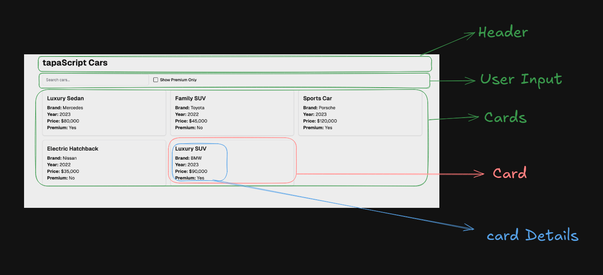
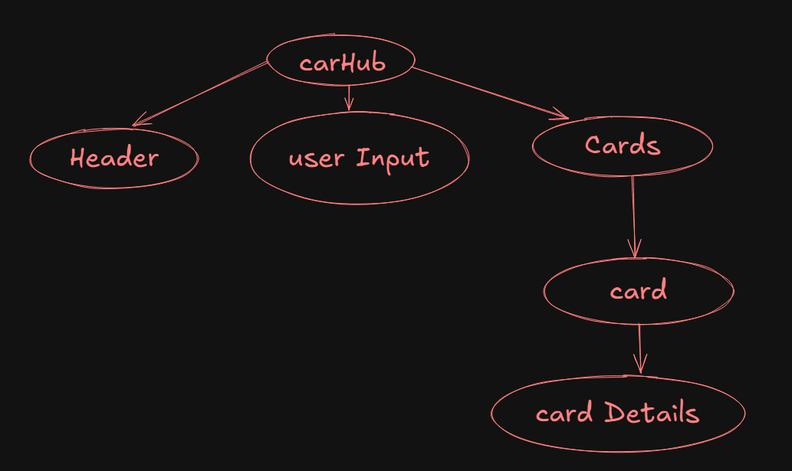
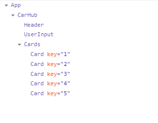

# CarHub

CarHub is a premium car search platform where users can explore and view the most luxurious and high-end vehicles. The application offers a seamless user experience with an intuitive design and well-structured UI components.

---

## Getting Started

Follow these commands to start the project:

### Using npm

```bash
npm install
npm start
```

### Using yarn

```bash
yarn install
yarn start
```

### Using bun

```bash
bun install
bun start
```

---

## Project Overview

CarHub allows users to:

- Search for premium cars.
- Explore detailed information about luxury vehicles.
- Enjoy a user-friendly interface for effortless navigation.

---

## Screenshots

---

## UI Component Breakdown

Below is a visual representation of how the UI components are divided:



---

## Flow Diagram / Component Hierarchy

This flow diagram showcases the structure and hierarchy of the components in CarHub:



---

## React Developer Tools

Here is a screenshot of the React Developer Tools while inspecting the project:



---

## Deployment

The project is live and can be accessed at the following link:

[CarHub Deployment]

---

Feel free to explore and enjoy the premium car experience on CarHub!
